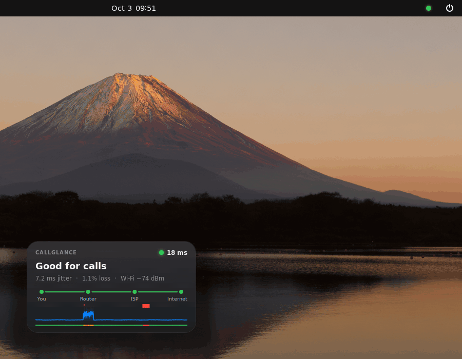
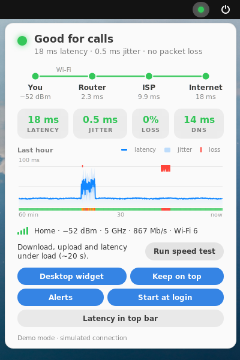
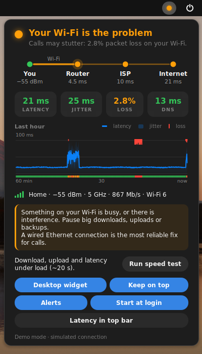
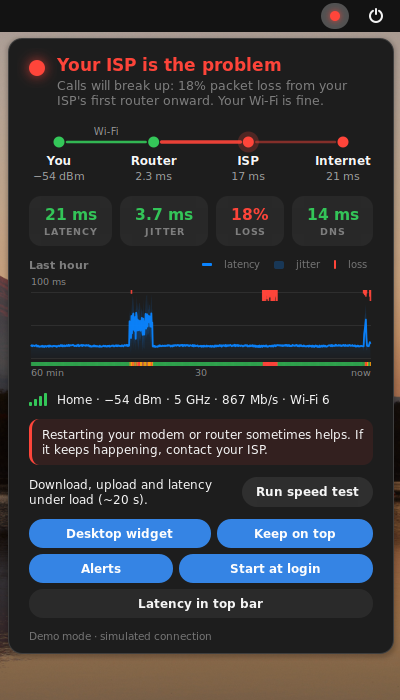
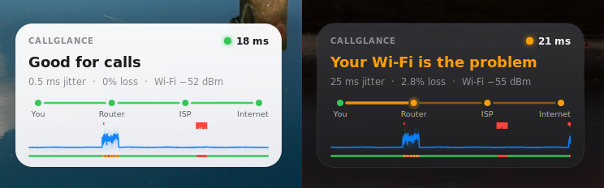
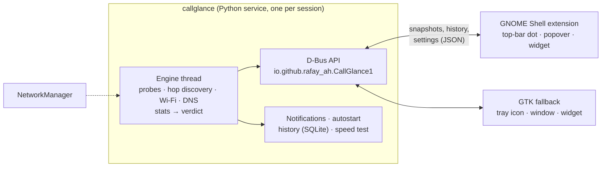

<p align="center">
  
</p>

<h1 align="center">CallGlance</h1>

<p align="center">
  <b>Is your connection good enough for calls?</b><br>
  A coloured dot in your top bar that also knows whether your Wi-Fi or your ISP is to blame.
</p>

<p align="center">
  <a href="https://github.com/rafay-ah/callglance/actions/workflows/ci.yml"></a>
  
  
  <a href="LICENSE"></a>
</p>

<p align="center">
  
</p>
<p align="center"><sub>The real GNOME Shell extension, recorded with the built-in demo (<code>callglance --demo</code>):
the Wi-Fi breaks down, recovers, then the ISP starts dropping packets.</sub></p>

---

When a call gets choppy, the question is always the same: *is it my Wi-Fi, my router, or my ISP?*
CallGlance measures every hop of the way, all the time: your router, your ISP's first router and
the internet beyond. It tells you in plain words where the trouble starts.

- **A dot in the top bar.** Green is good for calls, amber means calls may stutter, red means they will
  break up. Click it for the verdict, the path from you to the internet, live latency, jitter, loss
  and DNS times, and a one-hour graph you can hover.
- **A plain-language verdict.** *Good for calls*, *Your Wi-Fi is the problem*, or *Your ISP is the
  problem*, with a one-line reason and what to do about it.
- **Wi-Fi details** from NetworkManager: network, signal in dBm, band (2.4/5/6 GHz) and link speed.
- **A notification** when quality drops below what Zoom, Meet and Teams need, and when it recovers.
- **An on-demand speed test** with latency under load, graded A+ to F for bufferbloat.
- **A desktop widget.** Pin it above your windows or leave it on the desktop. It follows light and
  dark style, and you can drag it anywhere.
- **Starts at login** by default, with a toggle.
- **Lightweight and no root.** About 0.4 % of one CPU core, ~35 MB of memory and ~5 kbit/s of probes.

<p align="center">
  
  &nbsp;
  
  &nbsp;
  
</p>
<p align="center">
  
</p>

## Install

Packages are attached to every [release](https://github.com/rafay-ah/callglance/releases).

### Ubuntu and Debian (recommended)

```sh
sudo apt install ./callglance_0.1.0_all.deb
```

Open **CallGlance** from the app grid; from then on it starts at login. A tray icon appears right
away. **Log out and back in once**, and the dot moves into the top bar: GNOME Shell only picks up
newly installed extensions at login.

### AppImage (any distribution)

```sh
chmod +x CallGlance-0.1.0-x86_64.AppImage
./CallGlance-0.1.0-x86_64.AppImage
```

The AppImage runs on your system's Python with PyGObject, which every GNOME desktop already has.
If not: `sudo apt install python3-gi gir1.2-gtk-3.0 gir1.2-ayatanaappindicator3-0.1` (or your
distribution's equivalent). On its first start it adds itself to the app grid, installs the top-bar
extension for your user and turns on start at login. An `aarch64` build is attached too.

### From source

```sh
git clone https://github.com/rafay-ah/callglance && cd callglance
sudo apt install python3-gi python3-gi-cairo gir1.2-gtk-3.0 gir1.2-ayatanaappindicator3-0.1
PYTHONPATH=src python3 -m callglance             # start it
PYTHONPATH=src python3 -m callglance extension install   # top-bar extension (log out/in once)
```

### Optional: allow ICMP for the most precise numbers

CallGlance never needs root. It measures with ICMP "ping sockets" when your system allows them, and
with TCP, UDP and DNS probes otherwise ([details below](#measuring-without-root)). Fedora and Arch
allow ping sockets by default. Debian and Ubuntu (since 22.10) don't. To allow them, once:

```sh
callglance enable-icmp    # writes /etc/sysctl.d/60-callglance-ping.conf; asks for your password
```

## Using it

| | |
|---|---|
| **Top-bar dot** | Click for details. The graph shows the last hour: latency (line), jitter (band), packet loss (red ticks) and the verdict (bottom strip). Hover it for exact values. |
| **Desktop widget** | Turn it on in the popover. Drag it anywhere and it snaps to screen edges. Click it for details. Right-click to **keep it on top** of your windows or leave it on the desktop, or to hide it. |
| **Notifications** | One notice when quality has been below call grade for 20 s, another only if it gets worse, and a "back to good" note when it recovers. A connection that is always mediocre notifies you once, not every ten minutes. |
| **Speed test** | *Run speed test* in the popover, or `callglance speedtest`. Takes about 20 s and uses as much data as your line moves in that time (at most 350 MB). Runs only when you ask. |
| **Start at login** | On by default; toggle it in the popover or with `callglance autostart off`. |

It also works from a terminal:

```console
$ callglance status
● Your ISP is the problem
  Calls will break up: 11% packet loss from your ISP's first router onward. Your Wi-Fi is fine.

            Latency  Jitter  Loss   Measured with
  Router    2.3 ms   0.0 ms  0%     192.168.1.1 (tcp:9)
  ISP       17 ms    5.2 ms  12.5%  100.64.12.1 (udp-ttl2) ◀ starts here
  Internet  23 ms    3.1 ms  11.2%  1.1.1.1 (dns), 8.8.8.8 (dns)
  DNS lookups: 12 ms via 192.168.1.1
  Wi-Fi: Home · −53 dBm (excellent) · 5 GHz ch 36 · 866.7 Mb/s · Wi-Fi 6

  → Restarting your modem or router sometimes helps. If it keeps happening, contact your ISP.
```

(That is the demo's ISP episode; `callglance --demo` simulates a connection to try the interface.)
`callglance status --watch` keeps it updating, `--json` gives the raw data, and the exit status is
`0` when calls are fine. Also: `callglance speedtest`, `callglance doctor` (what it can use on your
system), `callglance autostart on|off` and `callglance quit`.

## How the verdict works

CallGlance keeps measuring three segments of the path:

```
 you ──(Wi-Fi)── router ──(access line)── ISP's first router ──── 1.1.1.1 / 8.8.8.8
                 segment 1                segment 2                   segment 3
```

A problem belongs to **the first segment where it appears and keeps appearing downstream**. Network
engineers read `mtr` reports by the same rule.

| What CallGlance sees | Verdict |
|---|---|
| Jitter or loss already on the way to your router, and everywhere after it | **Your Wi-Fi is the problem** (or *your home network*, when wired) |
| Router clean, trouble from your ISP's first router onward | **Your ISP is the problem** (*from your ISP's first router onward*) |
| Router and ISP router clean, trouble only at the internet targets | **Your ISP is the problem** (*beyond your router*) |
| Loss at a router that does not show up further along | **Ignored**. Routers deprioritise pings aimed at themselves, and that doesn't affect calls passing through them |
| Router answers, nothing beyond does | **Your ISP is the problem**: no internet |
| Not even the router answers | **Your Wi-Fi is the problem**: can't reach your router |

Some details that keep the verdict honest:

- **Probes are sent like a call's audio.** Each target gets bursts of 5 probes 20 ms apart, every 2 s.
  The first probe of a burst wakes the Wi-Fi radio from power saving. A call's steady stream never
  pays that cost, so that probe counts for loss but not for latency or jitter.
- **Statistics, not coin flips.** Packet loss is only blamed on a segment when the numbers support it.
  A binomial likelihood ratio decides whether the segment explains the loss seen further along. With
  too few probes to tell, the segment's own jitter and latency spread decide.
- **Latency and jitter use the last 30 s; loss uses the last 60 s.** A verdict gets worse at once, but
  only improves after it has held for a few seconds, so the dot doesn't flicker.
- **Wi-Fi tips** use voice-grade Wi-Fi design guidance: below **−67 dBm** voice starts to suffer
  ([Cisco](https://www3-realm.cisco.com/en/US/docs/wireless/technology/nokia/design/guide/nokia.pdf)).
  2.4 GHz and slow link rates are pointed out too.

### Call-grade thresholds

| Metric | Good | Calls may stutter | Calls will break up |
|---|---|---|---|
| Round-trip latency | < 100 ms | 100–300 ms | ≥ 300 ms |
| Jitter (mean change between consecutive round trips) | < 30 ms | 30–50 ms | ≥ 50 ms |
| Packet loss (round trip) | < 1.5 % | 1.5–3 % | ≥ 3 % |

Where these come from:

- [Microsoft Teams](https://learn.microsoft.com/en-us/microsoftteams/prepare-network) asks for
  < 100 ms round trip, < 1 % loss and < 30 ms jitter, each over any 15 s interval.
- [Zoom](https://support.zoom.com/hc/en/article?id=zm_kb&sysparm_article=KB0070504) recommends
  ≤ 150 ms latency, ≤ 40 ms jitter and ≤ 2 % packet loss.
- [Google Meet](https://support.google.com/a/answer/1279090) is best below 100 ms round trip and
  degrades from 300 ms.
- [ITU-T G.114](https://www.itu.int/rec/T-REC-G.114) puts the comfortable limit at 150 ms one way,
  which is about 300 ms round trip.

The vendors' jitter and loss figures are one way. CallGlance measures round trips, which add up both
directions, so its limits sit a little above theirs. Every threshold can be changed in the
[configuration](#configuration).

The **speed test** grades the extra latency under load the way
[Waveform's bufferbloat test](https://www.waveform.com/tools/bufferbloat) does: A+ < 5 ms, A < 30,
B < 60, C < 200, D < 400, F above that. It then says what kind of call the bandwidth carries: HD
video needs about 4 Mb/s each way, 720p about 1.5 Mb/s, audio about 0.1 Mb/s.

## Measuring without root

| Target | Preferred probe | Without ICMP |
|---|---|---|
| Router | ICMP echo | TCP handshake to a closed port (the router's kernel answers with a reset, as fast and steady as a ping). If that fails: a DNS query dnsmasq answers itself, HTTP(S) ports, or a TTL-limited probe |
| ISP's first router | ICMP echo | TTL-limited UDP probes; the router's "time exceeded" reply is read from the socket error queue (`IP_RECVERR`), the way `tracepath` works |
| 1.1.1.1, 8.8.8.8 | ICMP echo | DNS queries (they are DNS resolvers), then TCP 443 |

**Finding the ISP's router.** On every network change, and every 5 minutes, CallGlance sends
TTL-limited probes toward 1.1.1.1 to list the hops. The ISP's first router is the first hop that
isn't a private address. That skips a second home router, such as an ISP modem in front of your own.

**Choosing a probe for each target.** At start-up every probe method of every target is tried at once
for 2 seconds, and the preferred one that gets answers is kept. Unanswered probes of a method a
target ignores are never counted as loss. Many offices and clouds drop ICMP to the internet, and
that must not read as "your ISP is losing packets". If nothing on the internet answers anything at
all, that is reported as an outage straight away.

**DNS interception.** Some routers and ISPs answer all DNS traffic themselves. Then a DNS probe to
1.1.1.1 never leaves your home and would hide every ISP problem. CallGlance asks 1.1.1.1 for
`id.server` (class CHAOS), which only Cloudflare answers with a data-centre code. If anyone else
answers, it switches to TCP.

All probing runs in its own thread with a small `selectors` event loop. Round trips come from kernel
receive timestamps (`SO_TIMESTAMPNS`), so Python's own scheduling doesn't show up as jitter.

## Privacy

There is no telemetry and no account. CallGlance only talks to:

- your router;
- your ISP's first router;
- 1.1.1.1 and 8.8.8.8 (or the targets you configure);
- your own DNS server, for lookups of zoom.us, meet.google.com and teams.microsoft.com;
- `speed.cloudflare.com`, only when you run a speed test.

History stays on your computer (`~/.local/state/callglance/history.sqlite3`, 24 hours).

## Configuration

Settings live in `~/.config/callglance/config.json`. The popover and widget write the common ones.
Edit the file for the rest, then restart CallGlance with `callglance quit && callglance`:

| Key | Default | Meaning |
|---|---|---|
| `public_targets` | `["1.1.1.1", "8.8.8.8"]` | Internet targets (anycast, so near you) |
| `interval` | `2` | Seconds between bursts, per target |
| `train_length`, `train_spacing_ms` | `5`, `20` | Probes per burst, and their spacing |
| `window`, `loss_window` | `30`, `60` | Seconds of data behind latency/jitter, and behind loss |
| `thresholds` | `{}` | Overrides, e.g. `{"jitter_fair": 25, "loss_poor": 2}` (keys `latency_`/`jitter_`/`loss_` + `fair`/`poor`) |
| `notifications`, `notify_recovery` | `true`, `true` | Notify when quality drops / recovers |
| `notify_after`, `notify_cooldown` | `20`, `600` | Seconds a problem must last; minimum gap between two "dropped" notices |
| `dns_names`, `dns_interval` | call services, `15` | Names to time lookups of, and how often |
| `history_hours` | `24` | How much history to keep on disk |

## Architecture



- **The service** (`src/callglance`) does all the measuring and deciding. The probing engine is
  stdlib-only; PyGObject is used for D-Bus, NetworkManager and the windows.
- **The GNOME Shell extension** (`gnome-shell/`) is a thin view over the service's D-Bus API, written
  in GJS because that is the only way to draw in the GNOME top bar. It supports GNOME 45 to 51, the
  versions in Ubuntu 24.04 LTS through 26.10.
- **The GTK fallback** (`src/callglance/gtkui`) takes over when no extension is around: on KDE,
  XFCE, Cinnamon, MATE and Budgie, and on GNOME until the next login after installing. It is a tray
  icon (StatusNotifierItem) with the same window and widget, drawn by the same Cairo code.

## Development

```sh
PYTHONPATH=src python3 -m callglance --demo -v   # the full app on a simulated connection
python3 -m pytest                                # unit, loopback and D-Bus tests
sudo python3 -m pytest -m netsim                 # end-to-end, see below
packaging/build-deb.sh && packaging/build-appimage.sh   # packages land in dist/
```

**A simulated home network.** `tests/netsim` builds client, router, ISP and "internet" network
namespaces. It joins them through a small userspace link emulator, so delay, jitter and loss can be
injected on the Wi-Fi, the ISP line or upstream, with no `netem` kernel module needed. The tests run
the real engine as `nobody`, with and without ICMP allowed, and check the verdict for each scenario:

- Wi-Fi trouble;
- ISP loss and upstream jitter;
- both kinds of outage;
- ICMP blocked beyond the router;
- DNS interception.

CI runs all of them on every push.

**A headless GNOME Shell.** `tools/shellshot` starts a throwaway Wayland-headless GNOME Shell in the
Ubuntu session mode, with the extension loaded and a test-only helper for scripted clicks and
screenshots. The GIF and screenshots above come from it (`sudo tools/shellshot/record-demo.sh`).

**Releasing.** Bump `__version__` in `src/callglance/__init__.py`, tag `vX.Y.Z` and publish a GitHub
release. The release workflow tests, builds the `.deb`, the AppImages (x86_64 and aarch64) and the
extension zip, and attaches them with checksums.

## Troubleshooting

- **No dot in the top bar.** Log out and back in once after installing. Then check with
  `callglance doctor`: it reports whether the extension is installed, enabled and running.
- **The router shows no numbers** (a dashed grey link in the path). Your router ignores every kind
  of probe. Calls are still judged from the ISP and internet segments.
- **VPN.** With a full-tunnel VPN, the internet targets are measured through the tunnel; the router
  segment still tells you about your Wi-Fi.
- **IPv6.** Measurements use IPv4 for now.

## License

[MIT](LICENSE) © 2026 rafay-ah
